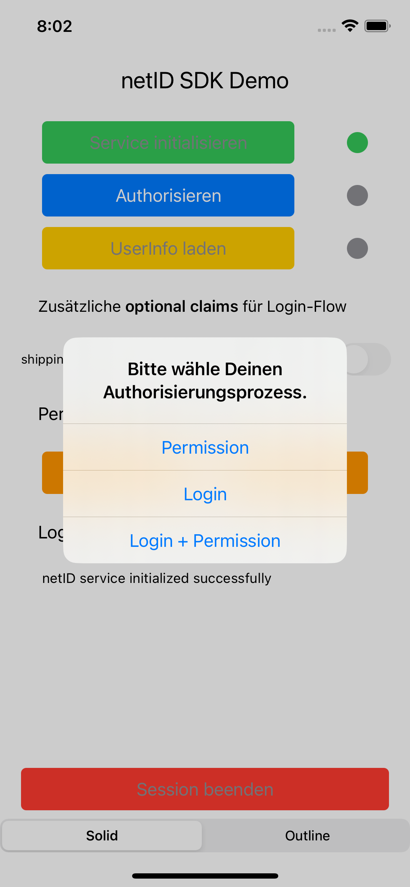
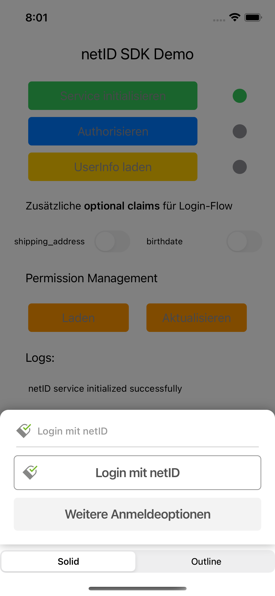
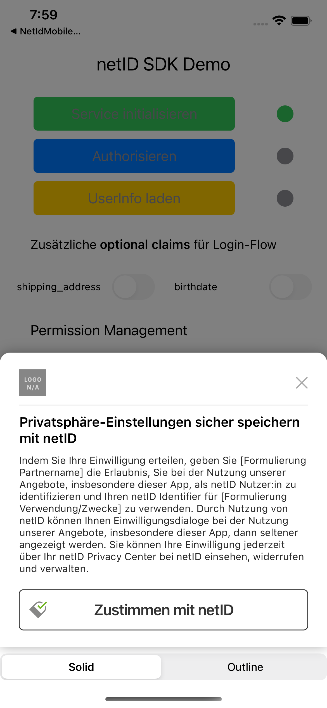
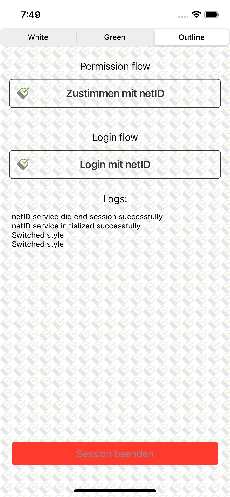

# netID MobileSDK for iOS

## About

The `netID MobileSDK` facilitates the use of the [netID](https://netid.de) authorization and privacy management services. 
Alongside the SDK, this repository hosts two sample apps, demonstarting the usage of the SDK. The first one is more complete as it demonstrates complete workflows including fetching/setting of additional values and/or user information. The second one is less complex and only demonstrates the basic workflow, if you want to add the different buttons for interacting with the SDK in a more direct way. 

## Initialize NetIDService

The `netID MobileSDK` facilitates the use of the [netID](https://netid.de) authorization and privacy management services. Alongside the SDK, this repository hosts a sample app, demonstrating the usage.

First you need to assign a delegate of type 'NetIdServiceDelegate' for receiving all callbacks made by the `NetIdService`.
```swift
NetIdService.sharedInstance.registerListener(self)
```

Then, construct a configuration object for the NetIDService:
```swift
let claims = "{\"userinfo\":{\"email\": {\"essential\": true}, \"email_verified\": {\"essential\": true}}}"
let config = NetIdConfig(
                clientId: "XXXXXXXX-XXXX-XXXX-XXXX-XXXXXXXXXXXX",
                redirectUri: "https://eunid.github.io/redirectApp",
                claims: claims,
                promptWeb: nil,
                loginLayerConfig: nil,
                permissionLayerConfig: nil)
```

The parameters have the following meaning:
| Parameter | Description |
| :- |    :- |
| clientId | The client id of your application. You can retrieve it from the netID Developer portal. This parameter is mandatory. |
| redirectUri | An URI that is used by your application to catch callbacks. You can retrieve it from the netID Developer portal. This parameter is mandatory. |
| claims | An OIDC-compliant, URL-encoded JSON string, denoting additional claims that should be set during authorization. Can be nil. |
| promptWeb | Additional value for parameter `prompt` that will be used during app2web-flow only. For valid values see https://openid.net/specs/openid-connect-core-1_0.html#AuthRequest. Can be nil. |
| loginLayerConfig | A set of strings, that can be used to customize the appearance of the layer for the login flow. Can be nil. |
| permissionLayerConfig | A set of strings, that can be used to customize the appearance of the layer for the permission flow. Can be nil. |

Besides the `clientId`, the `redirectUri` is the most important parameter in the configuration. The `redirectUri` is a link that is called by the authorization service to get back to your app once the authorization process has finished. To make your app capable of reacting to that uri, you have to instruct it to fetch it like in this example from the demo app:

```swift
@main
struct NetIdMobileSdk_AppApp: App {

    @StateObject private var serviceViewModel = ServiceViewModel()

    var body: some Scene {
        WindowGroup {
            ContentView().onOpenURL(perform: { url in
                serviceViewModel.resumeSession(url)
            })
            .environmentObject(serviceViewModel)
        }
    }
}
```

And then, by implementing the function `resumeSession` your app has to inform the netID SDK, that an authorization response has been delivered:

```swift
func resumeSession(_ url: URL) {
    NetIdService.sharedInstance.resumeSession(url)
}
```

As this is a rather crucial process, the netID SDK makes use of Universal Links to ensure proper and secure communication between the authorization service and your app. 
In order to make Universal Links work, you have to provide a link in the form of an uri (e.g. https://eunid.github.io/redirectApp) and host a special file named `apple-app-site-association` on that very same domain (in this example https://eunid.github.io/.well-known/apple-app-site-association).
The format of that file is explained in detail [here](https://developer.apple.com/documentation/xcode/supporting-associated-domains).

In Xcode make sure to add your domain to the list of `Associated Domains` in the section `Signing & Capabilities` of your app. You must add your domain for `applinks` to make it work both in app2web and app2app scenarios.


To learn more about Universal Links, see the corresponding documentation [here](https://developer.apple.com/documentation/xcode/allowing-apps-and-websites-to-link-to-your-content?language=objc).

Finally, initialize the NetIdService itself with the aforementioned configuration.
```swift
NetIdService.sharedInstance.initialize(config)
```
It makes sense to sum this up into one function like e.g.:
```swift
func initializeNetIdService() {
    initializationEnabled = false
    NetIdService.sharedInstance.registerListener(self)
    let config = NetIdConfig(clientId: "XXXXXXXX-XXXX-XXXX-XXXX-XXXXXXXXXXXX",
            redirectUri: "https://eunid.github.io/redirectApp"
            claims: nil,
            promptWeb : nil,
            loginLayerConfig: nil,
            permissionLayerConfig: nil)
    NetIdService.sharedInstance.initialize(config)
}
```

## Authorization

After the NetIDService has been initialized, subsequent calls to request authorization can be made. In the example app, you are presented with three choices as can be seen in this screenshot.



In your own app, you most likely will decide which flow to take without an user interaction. To initiate the authorization process, issue the following call to the NetIDService:
```swift
NetIdService.sharedInstance.getAuthorizationView(
    currentViewController: currentViewController, 
    authFlow: authFlow)
```

| Parameter | Description |
| :- | :- |
| currentViewController | Currently used view controller. |
| authFlow              | Type of flow to use, can be either ``NetIdAuthFlow.Permission``, ``NetIdAuthFlow.Login`` or ``NetIdAuthFlow.LoginPermission``. This parameter is mandatory. |
| forceApp2App          | If set to true, will yield an ``NetIdError`` if the are no Account Provider App installed. Otherwise, will use app2web flow automatically. Defaults to ``false``. |

You have to provide an instance of your app's activity so that the SDK can display a view for the authorization process itself. With the parameter `authFlow` you decide, if you want to use `Permission`, `Login` or `Login + Permission` as authorization flow. The optional parameter `forceApp2App` decides, if your app wants to use app2app only. If let alone, this parameter defaults to `false` meaning that if no Account Provider apps are installed, the SDK will automatically fall back to app2web flow. If set to `true` and no Account Provider apps are installed, this call will fail with an error.

Depending on the chosen flow, different views are presented to the user to decide on how to proceed with the authorization process.

<table>
    <tr>
        <th>Login Flow with no Account Provider Apps</th>
        <th>Permission Flow with no Account Provider Apps</th>
    </tr>
    <tr>
        <td width=50%>
            
        </td>
        <td width=50%>
            
        </td>
    </tr>
</table>

As stated above, it is possible to customize certain aspects of the dialog presented for authorization. For example:
```swift
let loginLayerConfig = LoginLayerConfig(
    headlineText: "Headline text", 
    loginText: "Login with app %s", 
    continueText: "Continue text")
``` 

And when using permission flow, the dialog can be customized as well:
```swift
let permissionLayerConfig = PermissionLayerConfig(
    logoId: "custom_logo_resource_name",
    headlineText: "Headline text", 
    legalText: "Legal text", 
    continueText: "Continue text")
``` 
Keep in mind that you can not customize the complete legal text in the dialog. The second part of it is predefined by netID.

The SDK will figure out by itself, if Account Provider apps like [GMX](https://apps.apple.com/de/app/gmx-mail-cloud/id417352269) or [web.de](https://apps.apple.com/de/app/web-de-mail-cloud/id368948250) are installed. If so, the SDK will always prefer the app2app-flow instead of app2web when communicating with the netID authorization service. When at least one of those apps is found, the call to `getAuthorizationView` will return a slightly different layout, exposing the installed apps:
<table>
    <tr>
        <td>
            <p><em>Login flow with multiple Account Provider Apps</em></p>
        </td>
        <td>
            <p><em>Permission flow with multiple Account Provider Apps / expanded choice menu - Default is to pre-select one App and collapse choice menu</em></p>  
        </td>
    </tr>
    <tr>
        <td width=50%>
        </td>
        <td width=50%>
        
        </td>
    </tr>
</table>

If the user did decide on how to proceed with the login process (e.g. which Account Provider provider to use), a redirect to actually execute the authorization is called automatically.

As can be seen from above screenshots, ui elements are organzied in layers to ease the authorization process. The SDK supports two different graphical styles, called ``Solid`` and ``Outline``. Switching between those two styles can be done in the demo app by using the picker element at the end of the screen. Programatically you can change the style by calling:

```swift
 NetIdService.sharedInstance.setLayerStyle(style)
```

## Session persistence
The SDK implements session persistence. So if a user has been authorized successfully, this state stays persistent even when closing and reopening the app again.

To test this with the demo app, close the app once you are successfully authorized. Then, open the app again. After pressing the ```SDK initialisieren```-button, your session will be restored and you are again authorized. So there will be no need to press ```Authorisieren``` again.

To get rid of the current session, the ```NetIdService.endsession()``` has to be called explicitly. In the demo app, this is done by pressing ```Session beenden```. Note, that this will delete the current session within the App only.

## Using the authorized service

Subsequent calls now can be made to use different aspects of the service.

```swift
NetIdService.sharedInstance.endSession()
```
Use this call to end a session. On the delegate `didEndSession` is called signaling success of the operation. All objects regarding authorization (e.g. tokens) will get discarded. However, the service itself will still be available. A new call to `getAuthorizationView` will trigger a new authorization process.

```swift
NetIdService.sharedInstance.fetchUserInfo()
```
Fetches the user information object. On success `didFetchUserInfo` is called on the delegate, returning the requested information. Otherwise `didFetchUserInfoWithError` gets called, returning a description of the error.

```swift
NetIdService.sharedInstance.fetchPermissions()
```
Fetches the permissions object. On success `didFetchPermissions` is called on the delegate, returning the requested information. Otherwise `didFetchPermissionsWithError` gets called, returning a description of the error.

```swift
NetIdService.sharedInstance.updatePermissions()
```
Updates the permissions object. On success `didUpdatePermissions` is called on the delegate, returning the requested information. Otherwise `didUpdatePermissionsWithError` gets called, returning a description of the error.

## Implementing the NetIdServiceDelegate

To be able to react to callbacks regarding the aforementioned functions, your application must conform to the `NetIdServiceDelegate` protocol. Depending on your type of application, you must not implemnt all callbacks in full detail (e.g. if you never intent to fetch user information, you could just implement a stub here), hence we only list the most important ones here.

```swift
/**
 Delegate function that gets called when the SDK could not be initialized correctly.
 In this case, a ``NetIdError`` is returned which holds more information about the error.
 - Parameter Error description.
 */
func didFinishInitializationWithError(_ error: NetIdError?)

/**
 Delegate function that gets called when the authentication process finished successfully.
 In this case, an access token is returned.
 - Parameter Access token.
 */
func didFinishAuthentication(_ accessToken: String)

/**
 Delegate function that gets called when user information could not be retrieved.
 In this case, a ``NetIdError`` is returned which holds more information about the error.
 - Parameter Error description.
 */
func didFinishAuthenticationWithError(_ error: NetIdError?)

/**
 Delegate function that gets called when a session ends.
 */
func didEndSession()

/**
 Delegate function that gets called when the authentication process got canceled.
 In this case, a ``NetIdError`` is returned which holds more information about the error.
 - Parameter Error description.
 */
func didCancelAuthentication(_ error: NetIdError)
```

## Button workflow

As stated in the beginning, there is another way to interact with the SDK. In the so called <i>button workflow</i> you can decide to not use the preconfigured forms and texts but build your very own dialogs.

Therefore, the SDK gives you the opportunity to only make use of the basic functionalities to use the SDK. As a starting point, take a look at the second demo app provided in the `NetIdMobileSdk/NetIdMobileSdk-ButtonApp` folder. Just like in the demo app, there is a possibility to change between different design sets to show off the different styles for the buttons. This can be done by calling the following function:

```swift
NetIdService.sharedInstance.setButtonStyle(style)
```
And ``style`` can be any style provided by ``NetIdButtonStyle``.

<table>
    <tr>
        <th>Style SolidWhite</th>
        <th>Style SolidGreen</th>
        <th>Style Outline</th>
    </tr>
    <tr>
        <td width=30%>
            
        </td>
        <td width=30%>
            
        </td>
        <td width=30%>
            
        </td>
    </tr>
</table>

Of course, at first you have to initialize the SDK as in the example above.
```swift
NetIdService.sharedInstance.registerListener(self)
let loginLayerConfig = LoginLayerConfig()
let permissionLayerConfig = PermissionLayerConfig()
let claims = "{\"userinfo\":{\"email\": {\"essential\": true}, \"email_verified\": {\"essential\": true}}}"
let config = NetIdConfig(
    clientId: "XXXXXXXX-XXXX-XXXX-XXXX-XXXXXXXXXXXX",
    redirectUri: "https://eunid.github.io/redirectApp",
    claims: claims,
    promptWeb: "consent",
    loginLayerConfig: loginLayerConfig,
    permissionLayerConfig: permissionLayerConfig)
NetIdService.sharedInstance.initialize(config)
```

Then, just request the buttons you need to trigger your desired auth flow. E.g. for the permission flow:

```swift
NetIdService.sharedInstance.continueButtonPermissionFlow(continueText: "")
```
With the optional parameter ``continueText``it is possible to alter the default text to a more personal liking. If set to an empty string or omitted completely, a default will be used.

Note that if any Account Provider apps are installed, there will be the possibility to choose which one to use (triggering app2app flow). For example, to display a button for each installed app, use this code:

```swift
ForEach((NetIdService.sharedInstance.getKeysForAccountProviderApps()), id: \.self) { key in
    NetIdService.sharedInstance.permissionButtonForAccountProviderApp(key: key, continueText: key)
}
```
Again, using the optional parameter ``continuteText`` will alter the text on the button - otherwise all buttons will have the standard text displayed.

For the login and/or login+permission flow, you can request a button to initiate app2web authorization with the following call:

```swift
NetIdService.sharedInstance.continueButtonLoginFlow(authFlow: .Login, continueText: "")
    .foregroundColor(serviceViewModel.endSessionEnabled ? Color.white : Color.gray)
```

And if you prefer app2app, you can request respective buttons for each Account Provider this way:

```swift
ForEach(NetIdService.sharedInstance.getKeysForAccountProviderApps(), id: \.self) { key in
    NetIdService.sharedInstance.loginButtonForAccountProviderApp(authFlow: .Login, key: key)
}
```

## Adding the libray to your own project

`netID MobielSDK for iOS` can be consumed as a package for the Swift Package Manager and as a Cocoa Pod. To include it in your own project, add the following dependency:

With Swift Package Manager, add the following dependency to your Package.swift:

```
dependencies: [
    .package(url: "https://github.com/eunid/netid-sdk-ios.git", .upToNextMajor(from: "1.0.0"))
]
````

With CocoaPods, add the following line to your Podfile:

```
pod 'NetIdMobileSdk', :git => 'https://github.com/eunid/netid-sdk-ios.git', :tag => '1.0.0'
```

