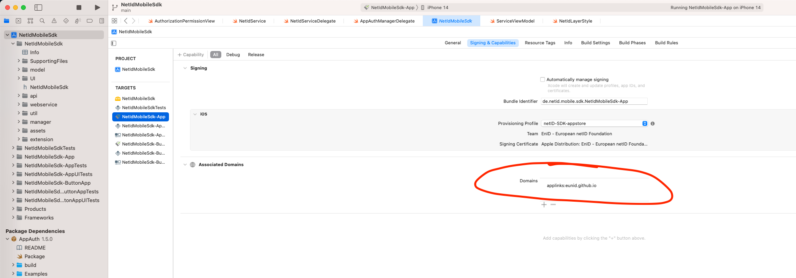

# netID MobileSDK for iOS

## About

The `netID MobileSDK` facilitates the use of the [netID](https://netid.de) authorization and privacy management services.
Alongside the SDK, this repository hosts a sample app, demonstarting the implemented features.

## Initialize NetIDService

The `NetIdService` is the main interface to communicate with the netID SDK. It handles all the communication with the backend services and provides ui elements for the autherization flow.

First you need to assign a delegate of type 'NetIdServiceDelegate' for recieving all callbacks made by the `NetIdService`.
```swift
NetIdService.sharedInstance.registerListener(self)
```

Then, construct a configuration object for the NetIDService:
```swift
var claims = Dictionary<String, String>()
claims["claims"] = "{\"userinfo\":{\"email\": {\"essential\": true}, \"email_verified\": {\"essential\": true}}}"
let config = NetIdConfig(
                clientId: "XXXXXXXX-XXXX-XXXX-XXXX-XXXXXXXXXXXX",
                redirectUri: "https://eunid.github.io/redirectApp",
                claims: claims
                promptWeb: nil,
                loginLayerConfig: nil
                permissionLayerConfig: nil)
```

The parameters have the following meaning:
| Parameter | Description |
| :---        |    :---   |
| clientId | The client id of your application. You can retrieve it from the netID Developer portal. This parameter is mandatory. |
| redirectUri | An URI that is used by your application to catch callbacks. You can retrieve it from the netID Developer portal. This parameter is mandatory. |
| claims | An OIDC-compliant, URL-encoded JSON string, denoting additional claims that should be set during authorization. Can be nil. |
| promptWeb | Additional value for parameter `prompt` that will be used during app2web-flow only. For valid values see https://openid.net/specs/openid-connect-core-1_0.html#AuthRequest. Can be nil.
| loginLayerConfig | A set of strings, that can be used to customize the appearance of the layer for the login flow. Can be nil. |
| permissionLayerConfig | A set of strings, that can be used to customize the appearance of the layer for the permission flow. Can be nil. |

Besides the `clientId`, the `redirectUri` is the most important parameter in the configuration. The `redirectUri` is a link that is called by the authorization service to get back to your app once the authorization process has finished. As this is a rather crucial process, the netID SDK makes use of Universal Links to ensure proper and secure communication between the authorization service and your app. 
In order to make Universal Links work, you have to provide a link in the form of an uri (e.g. https://netid-sdk-web.letsdev.de/redirect) and host a special file named `apple-app-site-association` on that very same domain (in this example https://netid-sdk-web.letsdev.de/.well-known/apple-app-site-association).
The format of that file is explained in detail [here](https://developer.apple.com/documentation/xcode/supporting-associated-domains).

In Xcode make sure to add your domain to the list of `Associated Domains` in the section `Signing & Capabilities` of your app. You must add your domain for `webcredentials` as well as for `applinks` to make it work both in app2web and app2app scenarios.



To learn more about Universal Links, see the corresponding documentation [here](https://developer.apple.com/documentation/xcode/allowing-apps-and-websites-to-link-to-your-content?language=objc).

Finally, initialize the NetIdService itself with the aforementioned condfiguration.
```swift
NetIdService.sharedInstance.initialize(config)
```
It makes sense to sum this up into one function like e.g.:
```swift
func initializeNetIdService() {
    initializationEnabled = false
    NetIdService.sharedInstance.registerListener(self)
    let config = NetIdConfig(clientId: "XXXXXXXX-XXXX-XXXX-XXXX-XXXXXXXXXXXX",
            redirectUri: "https://eunid.github.io/redirectApp"
            claims: nil,
            promptWeb : nil,
            loginLayerConfig: nil,
            permissionLayerConfig: nil)
    NetIdService.sharedInstance.initialize(config)
}
```

## Authorization

After the NetIDService has been initialized, subsequent calls to request authorization can be made. In the example app, you are presented with three choices as can be seen in this screenhsot.


In your own app, you most likely will decide which flow to take without an user interaction. To initiate the authorization process, issue the following call to the NetIDService:
```swift
NetIdService.sharedInstance.getAuthorizationView(currentViewController: currentViewController, authFlow: authFlow)
```

| Parameter | Description |
| :---        |    :---   |
| currentViewController | Currently used view controller. |
| authFlow | Type of flow to use, can be either ``NetIdAuthFlow.Permission``, ``NetIdAuthFlow.Login`` or ``NetIdAuthFlow.LoginPermission``. This parameter is mandatory. |
| forceApp2App | If set to true, will yield an ``NetIdError`` if the are no ID apps installed. Otherwise, will use app2web flow automatically. Defaults to ``false``. |

You have to provide an instance of you app's activity so that the SDK can display a view for the authorization process itself.
With the parameter `authFlow`you decide, if you want to use `Permission`, `Login` or `Login + Permission` as authorization flow.
The optional parameter `forceApp2App` decides, if your app wants to use app2app only. If let alone, this parameter defaults to `false` meaning that if no ID provider apps are installed, the SDK will automatically fall back to app2web flow. If set to `true` and no ID provider apps are installed, this call will fail with an error.

Depending on the chosen flow, different views are presented to the user to decide on how to proceed with the authorization process.

<table>
<td></td>
<td></td>
</table>

As stated above, it is possible to customize certain aspects of the dialog presented for authorization. For example:
```swift
let loginLayerConfig = LoginLayerConfig(headlineText: "Headline text", loginText: "Login with app %s", continueText: "Continue text")
``` 

The SDK will figure out by itself, if account provider apps like [GMX](https://apps.apple.com/de/app/gmx-mail-cloud/id417352269) or [web.de](https://apps.apple.com/de/app/web-de-mail-cloud/id368948250) are installed. If so, the SDK will always prefer the app2app-flow instead of app2web when communicating with the netID authorization service. When at least one of those apps is found, the call to `getAuthorizationView` will return a slightly different layout, exposing the found apps:
<table>
<td><p><em>Login flow with installed id apps</em></p></img></td>
<td><p><em>Permission flow with installed id apps</em></p></img></td>
</table>

If the user did decide on how to proceed with the login process (e.g. which ID provider to use), a redirect to actually execute the authorization is called automatically.

## Session persistence
The SDK implements session persistence. So if a user has been authorized successfully, this state stays persistent even when closing and reopening the app again.

To test this with the demo app, close the app once you are successfully authorized. Then, open the app again. After pressing the ```SDK initialisieren```-button, your session will be restored and you are again authorized. So there will be no need to press ```Authorisieren``` again.

To get rid of the current session, the ```NetIdService.endsession()``` has to be called explicitly. In the demo app, this is done by pressing ```Session beenden```. Note however, that this will destroy the current session only. There will be no logout on the server itself.

## Using the authorized service

Subsequent calls now can be made to use different aspects of the service.


```swift
NetIdService.sharedInstance.endSession()
```
Use this call to end a session. On the delegate `didEndSession` is called signalling success of the operation. All objects regarding authorization (e.g. tokens) will get discarded. However, the service itself will still be available. A new call to `getAuthorizationView` will trigger a new authorization process.

```swift
NetIdService.sharedInstance.fetchUserInfo()
```
Fetches the user information object. On success `didFetchUserInfo` is called on the delegate, returning the requested information. Otherwise `didFetchUserInfoWithError` gets called, returning a description of the error.

```swift
NetIdService.sharedInstance.fetchPermissions()
```
Fetches the permissions object. On success `didFetchPermissions` is called on the delegate, returning the requested information. Otherwise `didFetchPermissionsWithError` gets called, returning a description of the error.

```swift
NetIdService.sharedInstance.updatePermissions()
```
Updates the permissions object. On success `didUpdatePermissions` is called on the delegate, returning the requested information. Otherwise `didUpdatePermissionsWithError` gets called, returning a description of the error.
